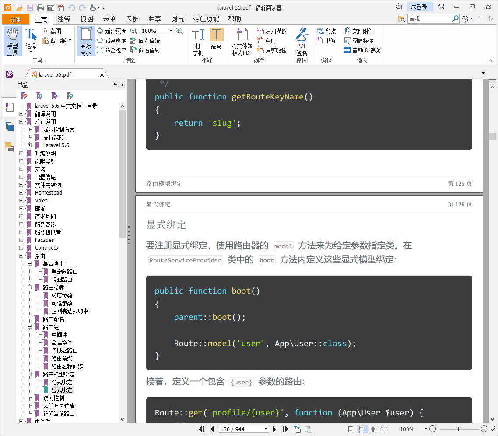

# Laravel 中文文档构建工具

这是一个用于构建laravel中文PDF文档的工具

### 前台抓取

前往[laravel文档目录页](https://laravel-china.org/docs/laravel/5.6)，打开控制台，复制`fetch.js`中的内容执行

### 后台保存

抓取到的内容会通过ajax请求，发送到后端的`save.php`,并保存为`all.html`

### pdf构建

最后双击build.bat，将调用[calibre](https://calibre-ebook.com/download) 的ebook-convert命令行工具,将HTML转换为PDF版本

### 效果展示

